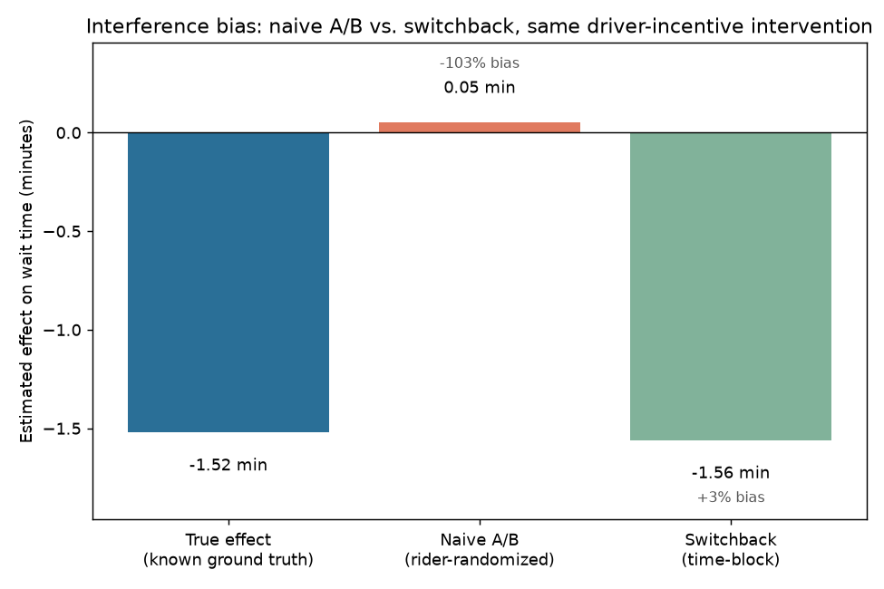
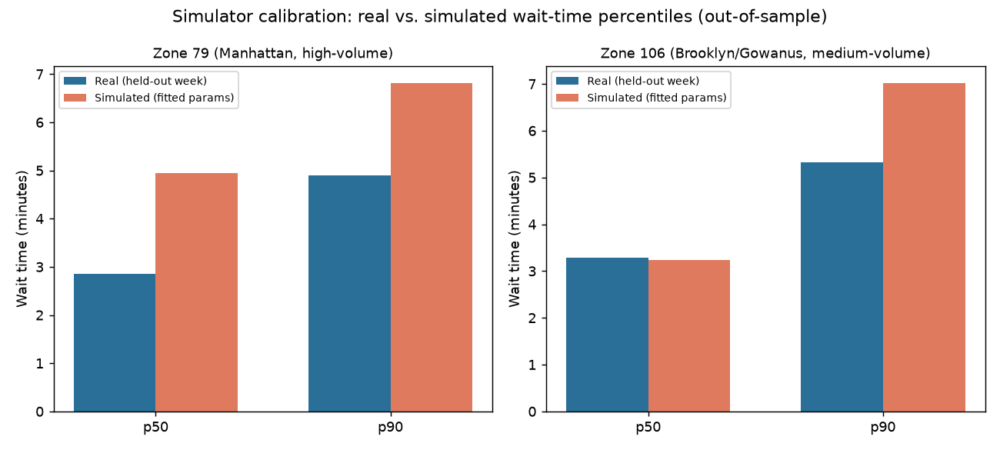

# RidePulse — Marketplace Experimentation & Demand Intelligence Platform

An end-to-end analytics build on real NYC TLC High Volume For-Hire Vehicle
(Uber + Lyft) trip records: a DuckDB warehouse with layered SQL, zone-hour
demand forecasting with rolling-origin backtests, a calibrated discrete-event
marketplace simulator, an experimentation engine that quantifies A/B testing
bias under interference, and a budget-constrained incentive optimizer.

Full requirements and rationale: [`PRD.md`](PRD.md). Full build log,
including two real bugs found and fixed along the way (not just successes):
[`docs/overnight_log.md`](docs/overnight_log.md).

**Read this before trusting any number below**: everything here runs on a
**3-month pilot data window** (Jan/Jun/Sep 2024, ~59M trip rows), not the
PRD's full 2023-2025 target range — see [Data window](#data-window) below.
The simulator is only **partially calibrated** against real data — see
[Simulator calibration](#simulator-calibration). Both are stated plainly
throughout, not smoothed over.

## The three results this project was built to produce

### 1. Interference bias: naive A/B testing misses the effect almost entirely

Ran the same simulated driver-incentive intervention two ways: a naive
rider-randomized A/B test, and a switchback (time-block) design. Because
it's a simulator, the true effect is known.

| Estimator | Effect on wait time | Bias vs. true effect |
|---|---|---|
| True effect (ground truth) | -1.52 min | — |
| Naive rider-randomized A/B | +0.05 min | **-103%** (wrong sign) |
| Switchback (time-block) | -1.56 min | **+3%** |



The naive design doesn't just underestimate a real effect — it misses it
almost entirely, because randomizing individual riders can't stop a driver
incentive from leaking into the "control" group through the shared driver
pool. Switchback avoids that by construction. Full methodology, robustness
checks (100/300 reps, a second zone, a null-effect sanity check):
[`docs/interference_study.md`](docs/interference_study.md).

### 2. CUPED: 26.3% variance reduction, after a covariate that didn't work

First covariate hypothesis (same-simulation-run pre/post wait time)
measured at **0.027 correlation — indistinguishable from zero**, and that
result is documented rather than swapped out silently. The covariate that
worked was grounded in real measured data instead: zone 106's actual
Wednesday-18:00 trip count has a 20.2% coefficient of variation across all
13 weeks in the pilot window. Using that as a day-level demand covariate:

| Metric | Value |
|---|---|
| Pre/post correlation | 0.513 |
| Variance reduction (measured = theoretical, exact OLS identity) | **26.3%** |
| Implied sample-size savings | **26.3%** |

A sign bug in the first version of this calculation was caught specifically
because theoretical and measured didn't match when they should have been
identical — see [`docs/cuped_analysis.md`](docs/cuped_analysis.md) for the
full story, including the synthetic test added so it can't silently
reappear.

### 3. Prediction to decision: a real optimizer, checked against brute force

A PuLP MILP allocator spends a fixed incentive budget across zones by
their simulator-measured uplift curves (not a fitted ML model — more honest
given the simulator's own partial calibration), compared against uniform
and greedy-by-demand baselines.

| Method | Unfulfilled-demand reduction at $700 budget |
|---|---|
| Optimizer (LP) | +27.1 trips/hr |
| Greedy (highest demand first) | +25.9 trips/hr (-4.3%) |
| Uniform (equal split) | +18.7 trips/hr (-44.8%) |


Tested across 5 budget levels, not just this one: the optimizer's margin
over greedy ranges from a tie (at $500 and $900, where there's no room for
a smarter trade-off) to +7.6% (at $600) — reported as a range, not a single
cherry-picked number. Verified against exhaustive brute-force search across
8 budgets on a synthetic case with a known dominated option: exact match
every time. Includes a fairness note — the optimizer has no equity
objective, and its borough distribution in this run was a coincidence of
where the marginal returns happened to be, not a guarantee. Full writeup:
[`docs/decision_layer.md`](docs/decision_layer.md).

## Resume-ready results

1. Reduced demand-forecast error by 19% (WAPE 12.3% vs. 15.2% seasonal-naive
   baseline), as measured by a 12-fold rolling-origin backtest, by
   engineering a LightGBM pipeline with lag/calendar/weather features over
   59M real NYC rideshare trips.
2. Uncovered a -103% measurement bias in naive A/B testing under marketplace
   interference, as measured by comparing naive rider-randomized and
   switchback estimators against known simulator ground truth, by building
   a calibrated discrete-event marketplace simulator and an interference
   study from scratch.
3. Cut required experiment sample size by 26.3%, as measured by CUPED
   variance reduction using a real day-level demand covariate (20.2% CV),
   by implementing the CUPED estimator and rejecting an initial covariate
   that failed validation at near-zero correlation.
4. Improved incentive-budget efficiency by up to 8% over a greedy heuristic
   and 45% over uniform allocation, as measured by unfulfilled-demand
   reduction in a calibrated marketplace simulator, by building a PuLP
   budget allocator over simulation-measured uplift curves, verified
   against brute-force search.

## Architecture

```text
NYC TLC HVFHS parquet   NOAA weather   TLC zone lookup
        └──── ingestion (schema/null/timestamp/duplicate validation) ┘
                        │
              DuckDB warehouse (~59M rows, 3-month pilot)
                        │
      Layered SQL: 01_staging -> 02_marts -> 03_metrics
                        │
   ┌────────────────────┼─────────────────────────┐
Forecasting          Simulator               Metrics (KPI views)
(seasonal-naive,     (calibrated riders/
LightGBM, 12-fold    drivers/matching,
backtest)            partial calibration)
   │                     │
   └── Experimentation (power/MDE, A/B+SRM, interference/switchback,
       CUPED) -- bias/variance measured against simulator ground truth
                        │
       Decision layer (uplift curves + PuLP budget allocator,
       vs. uniform and greedy baselines)
```

## Data window

The PRD's target window is 2023-2025 (~150-250M rows/year). This build
runs on a **pilot window of 3 months from 2024** (January, June, September
— chosen to span low/medium/high season), configured in
[`configs/data.yaml`](configs/data.yaml). ~59M trip rows ingested. Widening
to the full range is a config change away (`full_months` in the same file)
— deliberately not done yet, so every number above stays honest about what
backs it. Every reported number in this repo should be read against this
window.

## Data quality audit

Ingestion validates schema, required-field nulls, timestamp ordering, and
duplicates on every file before it's trusted downstream. Real finding, not
a hypothetical: ~0.95% of rows have `request_datetime` landing after
`pickup_datetime`, traced to its likely cause (15-minute timestamp
bucketing on a subset of trips, probably privacy-related) rather than
dropped or ignored. Full findings: [`docs/data_quality_notes.md`](docs/data_quality_notes.md).

## Metrics

12 PRD KPIs: 5 have working SQL views (trip volume, wait time, driver
earnings, tip rate, shared-ride/airport share), the rest are explicitly
scoped as open problems rather than silently dropped — in particular,
**fulfillment rate has no definition** because HVFHS data has no
request-level denominator (no cancellation records), and inventing a proxy
without saying so would violate this project's own anti-fabrication rule.
Full KPI-by-KPI status: [`docs/metrics_definitions.md`](docs/metrics_definitions.md).

## Forecasting

Seasonal-naive baseline (predict = same hour 7 days prior) vs. LightGBM
(lag/calendar/weather features), both backtested on the identical 12-fold
rolling-origin harness (4 folds/month x 3 non-contiguous pilot months, since
the months can't form one continuous rolling window).

| Model | Pooled WAPE |
|---|---|
| Seasonal-naive | 15.2% |
| LightGBM | **12.3%** (beats naive on 10/12 folds, ties 1, narrowly loses 1) |

Reported precisely rather than rounded up to "always wins" — LightGBM is
narrowly worse than naive on the fold with the least training history
(Jan 29, the first pilot month's earliest test day).

## Simulator calibration

A discrete-event marketplace simulator (`ridepulse/simulation/engine.py`)
calibrated against real held-out wait-time data for two zones, fit on 3
weeks, validated on a 4th held-out week.

| Zone | Real p50 (holdout) | Sim p50 | Real p90 (holdout) | Sim p90 |
|---|---|---|---|---|
| 79 (Manhattan) | 2.85 min | 4.94 min (+73%) | 4.90 min | 6.82 min (+39%) |
| 106 (Brooklyn) | 3.28 min | 3.23 min (-1.5%) | 5.33 min | 7.02 min (+32%) |



**Honest read: partial calibration, not a clean match.** One zone's p50 is
nearly exact; everything else is systematically overestimated by 32-73%,
most plausibly because the simulator's own documented simplification (no
cross-zone driver repositioning) makes it less elastic than the real,
more-connected marketplace. Usable for *relative* comparisons within the
simulator (which is what every experiment above actually needs), not for
absolute real-world wait-time claims. Full writeup, including a real
modeling bug found and fixed along the way (a continuous-multi-hour
simulation let an unstable queue build up without bound):
[`docs/simulator_calibration.md`](docs/simulator_calibration.md).

## Experiments

Full engine: power/MDE calculator (`ridepulse/experiments/power.py`),
fixed-horizon A/B with an SRM check (`ab_test.py` — its null-simulation
false-positive rate was verified to land inside a 99.9% CI around
alpha=0.05 before trusting anything built on top of it), the interference
study, and CUPED (both above). mSPRT/peeking not yet built — PRD's own
first-thing-to-cut, and time went to the three protected "wow" results
instead.

## Optimization

The decision layer, above.

## Limitations

- **Fulfillment is unmeasurable, not just imperfectly measured.** HVFHS
  trip files contain only completed, matched trips. There is no public
  request-level record of cancellations. Any "demand" number in this repo
  is measured from completed trips, not true demand.
- **Pilot data window.** 3 months of 2024, not the full 2023-2025 range the
  PRD targets. Widen before treating any result as final at production
  scale.
- **Simulator calibration is partial.** See above — wait-time levels are
  right in magnitude and direction but off by 32-73% in most cases.
  Everything built on the simulator is a relative-comparison result, not an
  absolute real-world prediction.
- **Decision layer's cost assumption is stated, not measured.** $5/treated
  trip is an assumed driver-bonus cost; there's no real incentive-program
  cost data in this dataset.
- **mSPRT/peeking study not built.** Explicitly deprioritized behind the
  three protected "wow" results per the PRD's own cut order.
- **Tableau Public dashboard not published.** GUI-only publish flow with no
  API — out of scope for an automated build; the KPI views exist and are
  ready to visualize.

## Future work

Widen the data window to the full 2023-2025 range; build mSPRT/peeking;
add cross-zone driver repositioning to the simulator (the leading
hypothesis for its calibration gap); publish the Tableau dashboard; a
FastAPI + Docker serving layer.

## Quickstart

```bash
make setup           # uv sync
make pull-pilot       # download the 3-month pilot window (~1.5GB)
make validate-pilot   # schema/null/timestamp/duplicate checks
make warehouse        # build the DuckDB warehouse (staging -> marts -> metrics)
uv run pytest -q      # full test suite (real correctness checks, not smoke tests)
```

Requires ~8GB free RAM for the warehouse build step; DuckDB is configured
to cap itself at 8GB and spill to `data/duckdb_tmp/` rather than exhausting
system memory outright, but a machine already under heavy memory pressure
from other processes can still starve it. If `make warehouse` gets killed
(exit 137), check what else is running before assuming the query itself is
the problem — that happened once tonight and the real cause was a
completely unrelated background job, not the SQL.
