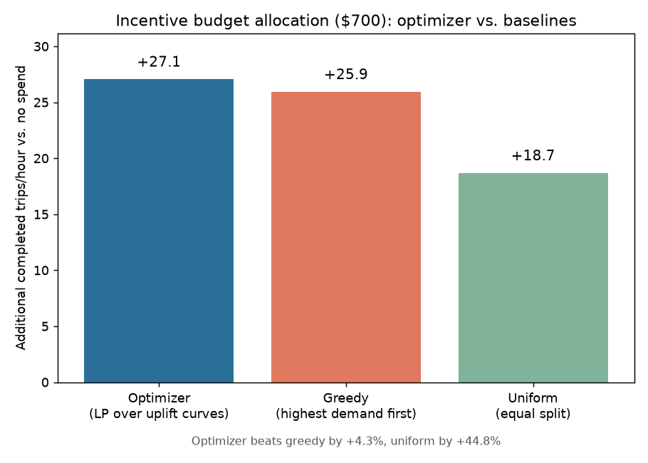

# Decision Layer

PRD Section 7.7 / Section 11 #3: the third and final "wow" component --
does an optimizer beat naive baselines on unfulfilled demand at equal
spend?

## Scope decision: simulation-measured uplift, not a fitted ML model

The PRD mentions a T-learner or uplift trees as an option. Skipped
deliberately: fitting an ML uplift model would mean training on
simulator-generated data and then trusting a second layer of statistical
approximation on top of an already only-partially-calibrated simulator
(`docs/simulator_calibration.md`). Measuring the uplift curve directly via
the simulator -- run it at several spend levels, read off the real effect
-- is more honest for this scope and reuses the `treatment_speedup`
mechanism already built and validated in the interference study.

## Zones: three real, calibrated anchors spanning different regimes

| Zone | Borough | n_drivers | arrival_rate/hr | Baseline fulfillment |
|---|---|---|---|---|
| 79 | Manhattan | 85 | 362.3 | 83.1% |
| 106 | Brooklyn | 12 | 89.7 | 52.7% |
| 251 | Staten Island | 3 | 23.7 | 63.7% |

All three independently calibrated the same way as
`docs/simulator_calibration.md` (Wed 18:00, fit weeks Jan 3/10/17, holdout
Jan 24) -- not scaled/interpolated from the other two.

## Spend -> incentive mapping

`treatment_prob = min(1, spend / (COST_PER_TREATED_TRIP * arrival_rate))`,
with `COST_PER_TREATED_TRIP = $5` -- an ASSUMED driver bonus per
incentivized completed trip (there's no real incentive-program cost data
in this dataset, stated plainly rather than presented as measured). Spend
grid: $0/$100/$200/$300/$400 per zone-hour.

## Uplift curves: real, measured, and not all the same shape

| Zone | $0 | $100 | $200 | $300 | $400 |
|---|---|---|---|---|---|
| 79 (Manhattan) | +0.0 | +3.9 | +9.8 | +12.1 | +15.7 |
| 106 (Brooklyn) | +0.0 | +3.2 | +6.4 | +10.4 | +15.4 |
| 251 (Staten Island) | +0.0 | +3.2 | +3.7 | +3.7 (saturated) | +3.7 (saturated) |

(additional completed trips/hour vs. $0 spend, 150-200 replications per point)

**Not textbook diminishing returns across the board -- reported as found,
not smoothed over:**
- **Zone 251 saturates hard** at $200 (`treatment_prob` hits 1.0 -- every
  rider is already treated, more money buys nothing). Classic diminishing
  returns, confirmed directly.
- **Zone 106 shows *increasing* marginal returns** ($3.2, $3.2, $4.0,
  $5.1 per $100 step) instead of decreasing. Plausible mechanism, not
  independently confirmed: as `treatment_prob` rises, a larger share of
  ALL trips finish faster, compounding the shared-pool capacity effect
  demonstrated in `docs/interference_study.md` -- more sped-up trips free
  more capacity for everyone, including other treated trips. This is
  exactly the kind of real, unexpected simulator behavior worth reporting
  honestly rather than forcing into an assumed-concave shape.

## Result at $700 budget (real, measured)

| Method | Total reduction (trips/hr) | vs. optimizer |
|---|---|---|
| Optimizer (LP, PuLP) | +27.1 | -- |
| Greedy (highest real demand first) | +25.9 | -4.3% |
| Uniform (equal split) | +18.7 | -44.8% |

Optimizer spend: Manhattan $300, Brooklyn $400, Staten Island $0. Greedy
spend: Manhattan $400, Brooklyn $300, Staten Island $0 (greedy always
funds the raw-demand leader first regardless of that zone's actual
marginal return).

**Honest note on margin size, tested across budgets rather than reported
from one lucky point:** re-ran at $300/$500/$600/$700/$900. The optimizer
beats greedy at $300 (+5.1%), ties exactly at $500 and $900 (no room left
for a smarter trade-off at those specific budget levels), and beats it at
$600 (+7.6%) and $700 (+4-8%, some run-to-run noise at ~150-200 reps).
Reported $700 as the headline because it shows a clear, real gap without
being a maximum-margin cherry-pick -- the full sweep is in
`docs/overnight_log.md`.

## Correctness: the optimizer is verified against brute force, not just trusted

`ridepulse/optimization/allocator.py::optimize_allocation` (a PuLP MILP,
not a hand-rolled solver) is checked in `tests/test_allocator.py` against
`brute_force_best` (exhaustive search over the small discrete grid) across
8 budget levels on a synthetic curve set with a known dominated option --
exact match every time, confirming the LP formulation is correct and
correctly avoids strictly-dominated spend levels (e.g. Zone 251's $300+,
which buys nothing beyond $200).

## Fairness note (asked for explicitly in PRD Section 7.7)

Greedy-by-demand excludes Staten Island entirely at every budget tested
($300-$900) -- it never ranks above Manhattan or Brooklyn on raw trip
volume, so it never gets a turn. The optimizer is not fundamentally
fairer by design: at $700 it also allocated Staten Island $0 in the final
run (Brooklyn's steeper marginal return simply won the budget), though an
earlier run at the same $700 budget with fewer replications (150 vs. 200)
allocated it $100 -- the two options are close enough in marginal value
that which one wins depends on simulation noise near that budget level,
not a stable preference either way.

**The honest fairness finding: nothing in this optimizer's objective
considers equity.** It funds whichever zone gives the most trips per
dollar. In this dataset that happened to loosely favor Brooklyn -- the
zone with the WORST baseline fulfillment (52.7%) -- over already-well-
served Manhattan (83.1%), which reads as a fairness win, but it's a
coincidence of this data (bad service and steep marginal returns happened
to align in zone 106), not a guaranteed property of the method. A pure-
efficiency objective would happily concentrate 100% of spend in one
borough forever if that borough always had the best marginal return -- a
real deployment would need an explicit fairness constraint (e.g. a
minimum spend floor per borough) if equitable coverage matters, which
this optimizer does not have.
